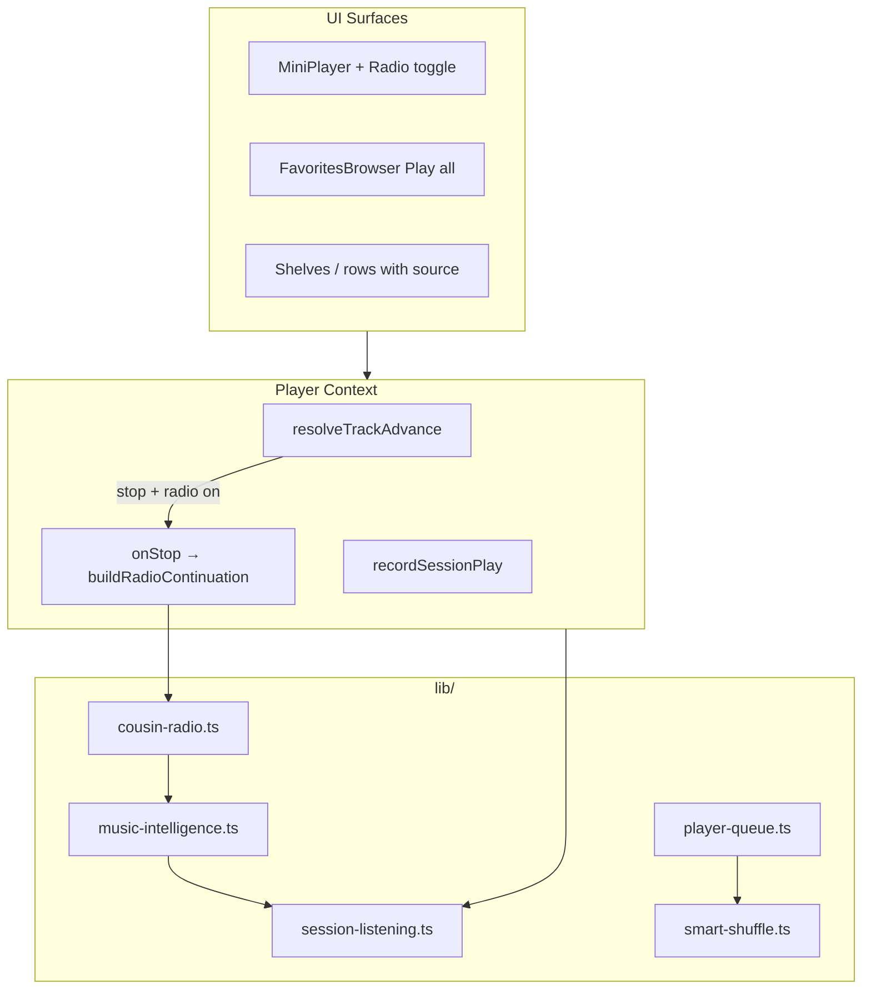

# Music Intelligence Orchestration — Spec & Recommendations

**Branch:** `cursor/music-intelligence-orchestration-b9c4`  
**Status:** Implemented (Phase 1)  
**App:** Cousin Radio / Family Jukebox  
**Date:** 2026-06-22

---

## Executive summary

Family Jukebox already has strong **deterministic** rotation (fair family mix, daily spotlight, celebration boosts) and basic tag-based discovery. The highest-leverage gap is that playback **stops** when a queue ends, personalization is **browser-local only**, shuffle is **pure random**, and analytics are **recorded but not consumed** for ranking.

This spec recommends and implements a **Music Intelligence Layer** — a set of composable, testable, deterministic algorithms that make listening feel more alive without ML infrastructure, external APIs, or catalog changes.

---

## Current state (audit)

| Area | Today | Gap |
|------|-------|-----|
| Queue advance | Stops at end unless repeat-all | No endless / radio mode |
| Shuffle | Fisher-Yates random | Same artist can play back-to-back |
| Discovery | Tag overlap only | No session memory, no diversity scoring |
| Favorites | Display + heart | No "Play favorites" queue |
| Analytics | Neon `play_events` | Not fed back into client ranking |
| Play source | Always `"unknown"` on start | Can't measure surface effectiveness |
| Session | Lost on refresh | No recently-played memory |

**Catalog constraints:** 16 songs, 8 artists — algorithms must prioritize **fair family representation** and **variety** over opaque "AI recommendations."

---

## Design principles

1. **Deterministic & testable** — every ranking function is pure given inputs; smoke tests lock behavior.
2. **Family-first** — round-robin author fairness is never sacrificed for engagement hacks.
3. **Graceful degradation** — works offline, without Neon, without localStorage.
4. **Composable** — small modules (`session-listening`, `music-intelligence`, `smart-shuffle`, `cousin-radio`) compose in the player.
5. **No ML in Phase 1** — tag overlap + session recency + fair rotation beats a black-box model for this catalog size.

---

## Recommended algorithms (priority order)

### P0 — Implemented in this branch

#### 1. Cousin Radio (endless playback)

**Leverage:** High — fixes the #1 UX dead-end (silence after queue ends).

When **Radio mode** is on and the queue finishes (repeat off), the player auto-builds the next batch from the seed track (last song played) using the intelligence scorer, excludes recently played tracks, and continues without user action.

- Toggle in mini-player (desktop + mobile)
- Persists for session in player state
- Default off (opt-in endless listening)

#### 2. Session listening memory

**Leverage:** High — enables recency-aware recommendations without accounts.

`sessionStorage` tracks:
- Last 20 played slugs (most recent first)
- Per-slug play count this session

Used to deprioritize repeats and power radio queue building.

#### 3. Unified music intelligence scorer

**Leverage:** High — one scoring function replaces ad-hoc discovery slices.

`scoreSongAffinity(seed, candidate, context)` combines:

| Signal | Weight | Rationale |
|--------|--------|-----------|
| Tag overlap | 40 | Existing "similar vibes" signal |
| Author diversity | 25 | Prefer other family members after current artist |
| Session freshness | 20 | Boost songs not heard recently this session |
| Featured / celebration | 10 | Align with existing calendar boosts |
| Catalog exploration | 5 | Slight boost for never-played-this-session songs |

`buildIntelligentQueue(seed, options)` returns an ordered list with fair author interleaving applied after scoring.

#### 4. Smart shuffle

**Leverage:** Medium — noticeable quality upgrade for shuffle users.

Greedy artist-diversity shuffle: after pinning the start track, each next pick maximizes distance from the previous `authorSlug`. Falls back to random when the pool is exhausted.

Integrated into `buildShuffledQueue` when smart mode is on (default for shuffle).

#### 5. Play source attribution

**Leverage:** Medium — unlocks analytics-driven product decisions later.

`useSongPlayback` accepts `source: PlaySource`. Player context forwards source to `trackPlayEvent` on start.

Surfaces wired: `hero`, `shelf`, `queue`, `detail`, `mini-player`.

#### 6. Play favorites

**Leverage:** Medium — completes an obvious user flow.

Favorites page gets "Play favorites" (shuffled smart queue) and "Play in order" when ≥2 favorites exist.

### P1 — Recommended next (not in this branch)

| Feature | Why | Effort |
|---------|-----|--------|
| Popularity-aware ranking | Fetch `/api/stats` top songs; boost underplayed cousins in family mix | Small |
| Up-next queue panel | Show `queue` from player context; drag reorder | Medium |
| Session resume | `sessionStorage` current song + `currentTime` | Small |
| Seek scrubber | Clickable progress bar in mini-player | Small |
| Config-driven celebrations | Move hardcoded dates to `data/celebrations.ts` | Small |
| Server-side co-play graph | Aggregate `play_events` sessions for "fans also played" | Medium |

### P2 — Future / larger scope

- Cross-device favorites sync (requires auth)
- Semantic search / typo tolerance
- Crossfade / gapless playback
- Video+audio unified player mode

---

## Architecture



### Module responsibilities

| Module | Exports | Role |
|--------|---------|------|
| `lib/session-listening.ts` | `recordSessionPlay`, `getRecentlyPlayedSlugs`, `getSessionPlayCount` | Browser session memory |
| `lib/music-intelligence.ts` | `scoreSongAffinity`, `buildIntelligentQueue`, `rankSimilarSongs` | Unified scoring & queue building |
| `lib/smart-shuffle.ts` | `buildSmartShuffledQueue` | Artist-diversity shuffle |
| `lib/cousin-radio.ts` | `buildRadioContinuation` | Endless queue batches |
| `lib/player-queue.ts` | `buildShuffledQueue` (+ smart path) | Playback order primitives |

---

## End-to-end implementation plan

### Phase 1 — Core algorithms (this PR)

1. Add `session-listening.ts` with sessionStorage helpers + SSR guards
2. Add `music-intelligence.ts` scorer and queue builder
3. Add `smart-shuffle.ts` and wire into `player-queue.ts`
4. Add `cousin-radio.ts` continuation builder
5. Extend smoke tests for all new pure functions

### Phase 2 — Player integration (this PR)

1. Player context: `radioMode`, `toggleRadio`, auto-continue on stop
2. Player context: record session play on track start
3. Player context: accept `playSource` on `playQueue` / `playSong`
4. `useSongPlayback`: pass `source` through
5. Mini-player: radio toggle button + aria labels
6. Favorites: play-all actions

### Phase 3 — Surface wiring (this PR)

1. Home hero / shelf / queue rows → correct `source`
2. Song detail → `detail`
3. Album pages → `shelf`

### Phase 4 — CI/CD validation (this PR)

1. `npm run smoke` — unit tests for algorithms
2. `npm run lint` — no new warnings
3. `npm run build` — production compile
4. PR → GitHub CI → staging path per `docs/CI-CD.md`

---

## Validation criteria

| Criterion | How verified |
|-----------|--------------|
| Radio builds non-empty continuation | Smoke: `buildRadioContinuation` returns ≥1 song |
| Smart shuffle avoids adjacent same-artist when possible | Smoke: no back-to-back same `authorSlug` for multi-artist queues |
| Session recency deprioritizes repeats | Smoke: recently played slugs score lower |
| Fair interleaving preserved | Smoke: radio queue has ≥2 authors when catalog allows |
| Player doesn't regress shuffle/repeat | Existing smoke tests pass |
| No SSR crashes on sessionStorage | Guards on `typeof window` |
| Favorites play-all works with 0/1 songs | UI hides button when <2 favorites |

---

## API / data changes

**None required for Phase 1.** All intelligence runs client-side against the static catalog.

Optional Phase 1b: extend `GET /api/stats` consumer on home page to pass `topSongs` into scorer context (additive, backward compatible).

---

## Rollout & safety

| Risk | Mitigation |
|------|------------|
| Radio loops same songs | Session recency + batch size 6 + exclude last 5 |
| sessionStorage quota | Cap at 20 slugs, minimal JSON |
| iOS autoplay policy | Radio continuation uses same `startPlayback` path (no deferred play) |
| Regression in repeat/shuffle | Existing `player-queue` tests unchanged + new tests |

**Feature flags:** Radio defaults **off**. Users opt in via mini-player toggle.

**Deploy path:** PR → CI green → merge to `main` → Vercel production per `docs/CI-CD.md`. Optional soak on `staging` first.

---

## Files changed (implementation map)

```
docs/MUSIC-INTELLIGENCE-SPEC.md          ← this document
lib/session-listening.ts                 ← new
lib/music-intelligence.ts                ← new
lib/smart-shuffle.ts                     ← new
lib/cousin-radio.ts                      ← new
lib/player-queue.ts                      ← smart shuffle integration
contexts/player-context.tsx              ← radio mode, session, sources
hooks/use-song-playback.ts               ← source param
components/mini-player.tsx                 ← radio toggle
components/favorites-browser.tsx          ← play favorites
components/recent-queue.tsx               ← source: queue
scripts/smoke.test.ts                     ← algorithm tests
```

---

## Decision log

| Decision | Choice | Alternatives considered |
|----------|--------|-------------------------|
| Personalization store | sessionStorage | localStorage (too sticky), Neon (latency, privacy) |
| Radio default | Off | On by default — rejected; family may want finite queues |
| ML recommendations | Deferred | Tag+session sufficient for 16-song catalog |
| Shuffle algorithm | Greedy diversity | Fisher-Yates only — kept as fallback |

---

## Appendix: example flows

### Flow A — Cousin Radio endless

1. User plays family mix (16 songs)
2. Enables Radio in mini-player
3. Last track ends → `buildRadioContinuation(lastSong)` → 6 new tracks
4. Playback continues; session memory prevents immediate repeats

### Flow B — Smart shuffle album

1. User plays album with shuffle on
2. `buildSmartShuffledQueue` orders tracks: start song pinned, then greedy artist spacing
3. Cousin artists alternate when possible

### Flow C — Play favorites

1. User hearts 4 songs across 3 artists
2. Favorites page → "Play favorites" → smart-shuffled queue
3. Sources tagged `shelf` for analytics
